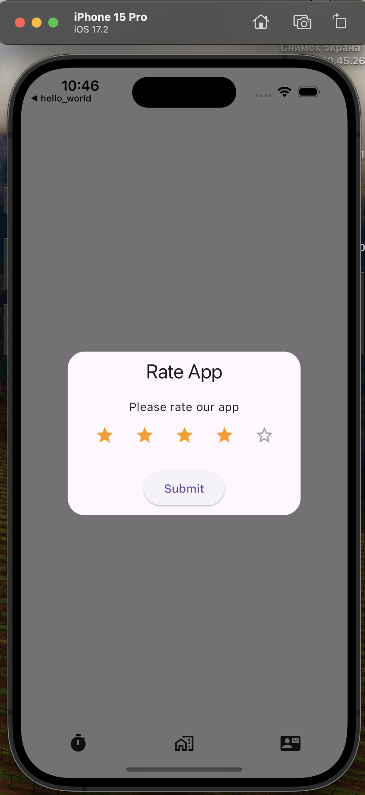

# energise_test

***Goal:*** Develop a mini application on Flutter that will be responsive and will work on iOS and Android.

**Basic requirements:**

Flutter

MVC architecture

***Requirements:*** Design in any format (any, we count on your creativity)

*Home Screen*

- In the center, put a round button with the "Play" icon, which should pulsate animatedly
- above the button we place a timer in the form (00:00:00)
- When pressing the "Play" button, rename the button to "Pause" with an icon, remove the animation, add a pulsation animation to the timer and start the timer. Stop the timer and press Pause to return the timer to its initial state

*Second screen*

- Using the API of the service https://ip-api.com/ we get all the information by IP
- At the beginning of the screen, we insert the map, after receiving the location from the service, we display it on the map. (view height +- 150-200)
- Below the map, we display all information from the service in an arbitrary form, with animation
- At the bottom, we add the "Reload" button, when pressed, a request for the service is sent and we update the data

*Third Screen*

- Create a table or collection with active buttons
- Must contain: Rate App - call the apple method that causes the star rating alert, Share App - call the method to share content, Contact us - create a method that natively opens the browser and goes to the link of this TK.

***Additional requirements:***

1. Add two localizations at once (English and German).
2. Use of animations and smooth transitions.
3. Implement the API data update function using the pull-to-refresh gesture on the second screen.
4. Add data caching on the second screen, and check if there is no response from the service, then display the data from the cache.
5. Add a tab bar for screen navigation.

[//]:

